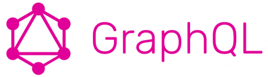

# PrismaJS with TypeScript + MongoDB + Lerna + AWS Lambda + Serverless





Starter kit for quick start with Typescript, Lerna, GraphQL and MongoDB locally
and deploy to AWS Lambda + MongoDB Shared Cloud using GitHub Actions.

## Technologies used

- Prisma - Next-generation Node.js and TypeScript ORM with GraphQL interface
  
  [https://www.prisma.io/](https://www.prisma.io/)

- MongoDB - JSON document database
  
  [https://www.mongodb.com/](https://www.mongodb.com/)

- Typescript - JavaScript with syntax for types
  
  [https://www.typescriptlang.org/](https://www.typescriptlang.org/)

- Lerna - A tool for managing JavaScript projects with multiple packages

  [https://lerna.js.org/](https://lerna.js.org/)

- GraphQL - query language for APIs and a runtime for fulfilling those queries with your existing data
  
  [https://graphql.org/](https://graphql.org/)\

- Rollup.js - module bundler for JavaScript which compiles small pieces of code into something larger and more complex, such as a library or application

- Docker Compose - tool for defining and running multi-container Docker
  applications. **Its used in this project to run MongoDB database in dev environment locally. Prisma Client requires Mongo to run in replica
  mode, so standalone MondoDB Community Server is not enough**

- GitHub Actions - makes it easy to automate all your software workflows,
  now with world-class CI/CD. Build, test, and deploy your code right from
  GitHub

  [https://github.com/features/actions](https://github.com/features/actions)

## Bootstrap lerna environment

```bash
npx lerna bootstrap
```

It will generate Prisma Client automatically with npm postinstall script.
When you modify your schema and want to test locally, then follow steps in
[Generate Prisma Client](#generate-prisma-client)

## Run project locally with MongoDB in Docker Compose

You will have a complete local development experience with debug and live reload
using MongoDB in Docker and Prisma Client in serverless offline mode.

### Start MongoDB with replica:

```bash
docker-compose up -d
```

### Run Prisma Client in serverless offline mode

```bash
npx lerna run --parallel dev
```

or inside packages/api

```bash
npm run dev
```

GraphQL Playground: http://localhost:3000/dev/graphql

## Generate Prisma Client

With Lerna:

```bash
npx lerna run prisma:generate
```

Or from inside **packages/prisma-client** package you can use it directly:

```bash
npx prisma generate
```

or

```bash
npm run prisma:generate
```

## Run sample code

```bash
npx ts-node index.ts
```

## Prisma Studio

Inside packages/prisma-client directory run this

```bash
npx prisma studio
```

## MongoDB Cloud Shared (M0 clusters) configuration

`You will have to add the infamous 0.0.0.0/0 CIDR block to your MongoDB Atlas cluster IP Whitelist because you won’t know which IP address AWS Lambda is using to make calls to your Atlas database.`

## Deploy to AWS Lambda

I'm using GitHub Actions as CI/CD tool to deploy using Serverless Framework to AWS Lambda.
But you can easily adjust it for any other CI/CD tool you prefer.
Checkout **.github/workflows/node.js.yml** for details.

It requires secrets to be added to project Actions configuration (Repository / Settings / Secrets / Actions):

- PROD_AWS_ACCESS_KEY_ID
- PROD_AWS_SECRET_ACCESS_KEY

  AWS security keys. [Read here](https://docs.aws.amazon.com/cli/latest/userguide/cli-configure-quickstart.html#cli-configure-quickstart-creds-create)
- PROD_DATABASE_URL
  
  MongoDB connection string. Get it from MongoDB Cloud admin (you can use any plan)

If you know what you are doing and want to deploy it manually
(temporary staging environment, for example, or demo purposes),
then crete **.env.local** and override DATABASE_URL with your own and run this:

```bash
npx lerna deploy
```

or inside packages/prisma-client

```bash
npx serverless deploy
```

## Connect project to Serverless Dashboard

```bash
npx serverless
```

## Demo

Checkout GraphQL with Playground deployed to AWS Lambda with MongoDB Cloud Shared:

https://rb7zk6fsce.execute-api.us-east-1.amazonaws.com/dev/graphql

Query example:

```graphql
# Write your query or mutation here
query {
  users {
    id
    email
    name
    __typename
  }
}
```

🤘💪🤣😍❤
